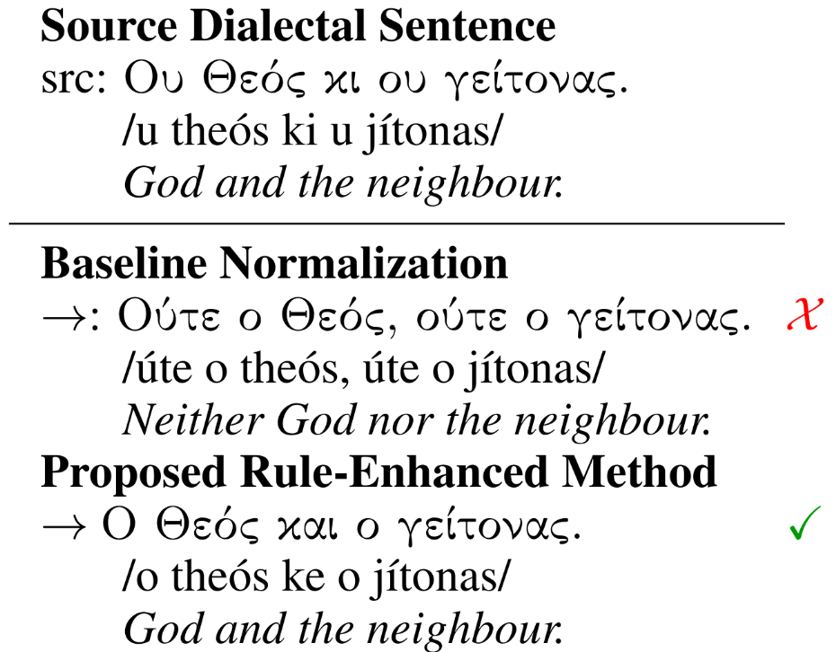

# Dialect Normalization using Large Language Models and Morphological Rules
Natural language understanding systems struggle with low-resource languages, including many dialects of high-resource ones. Dialect-to-standard normalization attempts to tackle this issue by transforming dialectal text so that it can be used by standard-language tools downstream. In this study, we tackle this task by introducing a new normalization method that combines rule-based linguistically informed transformations and large language models (LLMs) with targeted few-shot prompting, without requiring any parallel data. We implement our method for Greek dialects and apply it on a dataset of regional proverbs, evaluating the outputs using human annotators. We then use this dataset to conduct downstream experiments, finding that previous results regarding these proverbs relied solely on superficial linguistic information, including orthographic artifacts, while new observations can still be made through the remaining semantics.

Visualization:


# Instructions
The scripts provided in the "code" directory use, and produce, the data files provided in the "data" directory.

Example usage of a script:
```
python3 normalize_dialects.py
```

# Citation
If you use this code, dataset or the relevant findings in your research, please cite this work as follows:

```bibtex
@inproceedings{dimakis-etal-2025-dialnorm,
    title = "Dictionary-Aided Translation for Handling Multi-Word Expressions in Low-Resource Languages",
    author = "Dimakis, Antonios  and
      Pavlopoulos, John  and
      Anastasopoulos, Antonios",
    booktitle = "Findings of the Association for Computational Linguistics: ACL 2025",
    month = jul,
    year = "2025",
    address = "Vienna, Austria",
    publisher = "Association for Computational Linguistics",
    url = "https://arxiv.org/abs/2506.08907",
}
```
